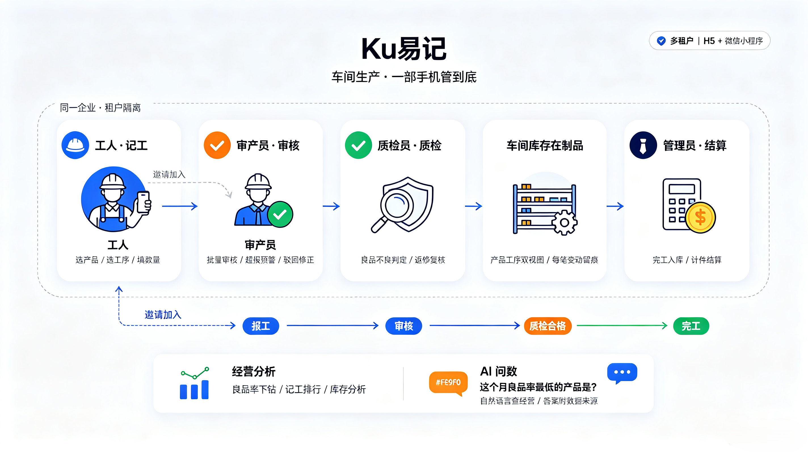
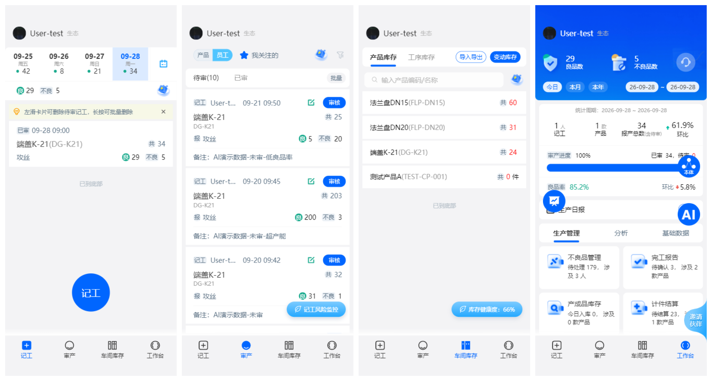
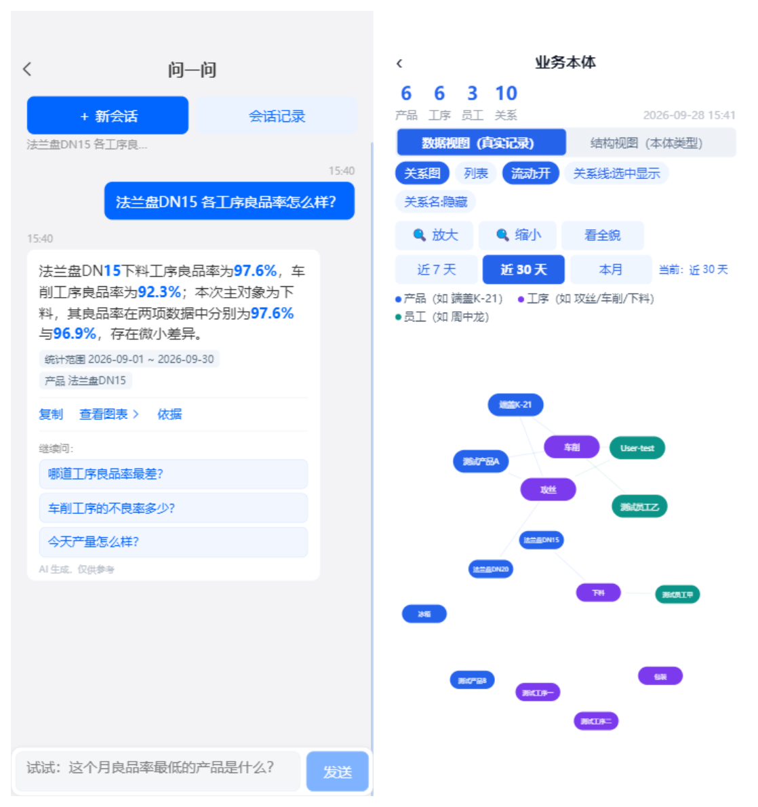

<!--
 * Copyright (c) 2026 海尔卡奥斯物联科技有限公司
 * Licensed under the Apache License, Version 2.0 (the "License");
-->

<div align="center">

<h1>Ku易记 · cosmo-hhim-open</h1>

<h3>让车间里每一件产品、每一次报工、每一笔结算都有据可查</h3>

[English](README_en.md) | 简体中文

[](LICENSE)
[](https://adoptium.net/)
[](https://spring.io/projects/spring-boot)
[](https://vuejs.org/)
[](https://uniapp.dcloud.net.cn/)
[](https://www.mysql.com/)
[](https://redis.io/)
[](https://docs.docker.com/compose/)
[](CONTRIBUTING.md)

</div>

---

<div align="center">



<sub>▲ <b>一张图看懂 Ku易记</b>：同一企业内租户隔离，<b>五类角色</b>各司其职（工人记工 → 审产员审核 → 质检员质检 → 车间在制品 → 管理员结算）；<br>
底下一行是他们共同推进的同一件事：<b>报工 → 审核 → 质检合格 → 完工</b>，每一环都落数据；最下方是这批数据最终的去处 —— <b>经营分析</b>（良品率下钻 / 记工排行 / 库存分析）与 <b>AI 问数</b>（自然语言查经营，答案附数据来源）。</sub>

</div>

---

**Ku易记** 是一套面向**离散制造车间**的开源精益生产管理平台。它把「工人报工 → 班组长审产 → 质检判定 → 完工入库 → 计件结算」这条现场主线装进**微信小程序和 H5**，再叠加一层**经营分析**与**AI 自然语言问数**，让车间里原本散落在纸质单据、Excel、微信群里的生产数据，第一次真正变成可追溯、可分析、可结算的结构化资产。

**不是又一个后台管理系统。** 它从工人的手机出发：产品和工序从列表点选，不用背编码、不用记流程，一次报工三步完成；班组长愿意天天用的审核流；老板一眼看得懂的经营看板。

<div align="center">



<br>

**📱 记工**　产品工序点选，三步完成　　**✅ 审产**　超报 / 低良品率 / 超产能自动标记<br>
**📦 车间库存**　产品·工序双视图 + 健康度预警　　**📊 工作台**　良品率、产量、审核进度一屏看完

</div>

---

## 🚀 核心特性

### 🏭 生产现场全链路闭环
> *从工人指尖的一次点击，到财务桌上的一张结算单，全程留痕。*

- **记工 / 报工**：工人按产品 + 工序报工，支持**批量报工**、**补录**（7 天内）、图片凭证、工序级库存联动；单条记录可编辑、可删除、可追溯修改历史。
- **审产防错**：班组长按待审/驳回/已审三态处理，支持**批量审核**、**撤销审核**、**我关注的**人员过滤；报工提交时后端自动打**三重风险标记**——**超报风险**（按良品流转口径预判是否会扣成负库存）、**良品率偏低**（对比该产品+工序的日均良品率）、**记工数超产能**（对比日产能上限）。异常记录在列表打标，并可跳转「记工风险」页按类型聚合成治理清单，逐条追溯与修正。
- **质检判定**：待检/已检双 Tab，支持合格/不良数量拆分、不良类型打标、**返修复核**全流程、质检记录时间线。
- **车间库存（在制品）**：产品库存 + 工序库存双视图，支持**直接调整**与**变动申请**两种模式，任何一次数量变动都落**变动历史**，附健康度预警。
- **完工入库**：完工报告（按日/按产品统计）→ 完工入库 → 出库，形成与报工数据自动对账的成品账。
- **计件结算**：按产品/员工双维度结算，支持结算历史明细、编辑态与结算态分离，**数据源自完工报告**（口径唯一）。

### 📊 经营分析：让数字自己开口
> *良品率掉了 3 个点，到底是哪台机床、哪道工序、哪个人？*

- **良品率分析**：产品 / 工序 / 员工**三个维度**自由下钻，附环比趋势与良品率趋势曲线；
- **质量趋势**：按日/月聚合的质量走势，与良品率分析合一看板；
- **记工排行**：员工报工量排行榜（Top-N），支持导出与邮件发送；
- **在制品查询**：按产品/工序检索在制品分布，点进即看工序级明细；
- **库存分析**：库存量排名、周转与异常（含"改"标与超报风险标记）；
- **完工产品统计**：按日/按产品的完工量统计与趋势；
- **生产日报**：支持**微信订阅消息**推送（订阅模板可在公众平台自助申请）。

### 🤖 AI 问数：对着手机问经营
> *"这个月良品率最低的产品是什么？" —— 像问同事一样问出口，答案还会告诉你它是从哪来的。*

- **问一句，答一句**：产量、良品率、不良明细、记工排名、库存、延期风险…… **12 类经营问题直接用大白话问**，不用先想"这个数在哪个报表里、该选哪个筛选条件"。
- **答案带着来历**：每个数字都能展开看**口径 / 来源 / 快照**三级依据——按什么算的、从哪来的、当时取的什么范围，看完再决定信不信，而不是只丢给你一个数。
- **说人话**：字段名中文化、比率自动转百分比、关键数字高亮、长答案可折叠；答完还给几条"你可能还想问"。
- **不会答就直说**：问工资、问结算、问能力之外的事，都会得到明确回复（甚至给你替代问法建议），**绝不编一个看起来很像的数字**。
- **会话能留存**：多会话管理（搜索 / 重命名 / 删除）、失败可在对话内重试、历史随时翻回来。
- **没配大模型也能用**：默认走规则解析 + 模板答案；配好密钥后自动升级为更强的理解与润色，**且数字会做一致性校验，校验不过自动退回模板**。
- **顺带能"看见"数据**：配套的 [业务本体图](#-业务本体可视化) 把「谁 / 什么 → 做了什么 → 剩多少 → AI 能答什么」画成一张关系图，点一条能力就能直接开问。

<details>
<summary><strong>🔧 技术实现（面向开发者 / 二次开发）</strong></summary>

- **Agent 循环编排（Plan-Act-Reflect-Replan）**
  - **Router 确定性分流**（不调 LLM）：空/超长、含**封禁词**（工资/薪资/薪酬/结算/罚款/报酬/提成）→ 边界话术；闲聊/礼貌语 → 独立应答；其余放行进主循环；
  - **Plan**（意图解析，LLM 优先 / 规则兜底）→ **代码归一**（时间、实体、组合白名单）→ **Act**（登记实现执行）→ **Reflect**（规则一级审视）→ 决策 **PASS / CLARIFY / REPLAN / STOP**；
  - **四道死循环闸**：①失败指标跟踪 ②确定性错误不重试 ③全失败无数据即停 ④有数据即输出；
  - 启动时打印**链路版本号**，排查"改了没生效"时一眼确认跑的是不是最新代码。
- **三通道能力分流 + 可信分级**（关键设计）：
  | 通道 | 取数方式 | 可信度 |
  | :--- | :--- | :--- |
  | **登记指标 / 算子** | 人写 SQL，可评审、可回归 | **权威口径**（存在即优先） |
  | **分析算子** | 确定性聚合 + 归因计算（回答"为什么"类问题） | **权威口径** |
  | **生成 SQL** | LLM 生成 → 过安全闸 → 只读执行 | **探索性**（`exploratory=true`，答案中如实标注） |
- **LLM 生成 SQL 也安全**：本通道设 **`SqlGuard` 三道闸**（基于 Druid AST 解析，非字符串匹配）——
  1. **语句类型闸**：解析后必须**恰好一条 SELECT**，任何 DML/DDL（INSERT/UPDATE/DELETE/DROP/TRUNCATE/ALTER/CALL）与多语句拼接**毫秒级直接拒绝**，不调 LLM、不重试；另加危险函数兜底（`sleep` / `benchmark` / `load_file` / `into outfile` / `information_schema` 等）；
  2. **对象白名单闸**：AST 收集到的表必须 ∈ 白名单，列不得命中敏感列（表级 + 字段级两层）；
  3. **强制约束（AST 改写）**：每个查询块的每张表都强制 AND 上 `tenant_code = '<当前租户>'`；无 `LIMIT` 或超上限则改写为上限行数（默认 500 行 / 单次最多 3 条语句）；
  - **全程审计**：每条生成 SQL 的 `SUCCESS` / `REJECTED` / `FAILED`、行数、耗时均落库；执行链路**最多 2 轮**（第 1 轮结果不足才带结果再生成一轮，硬上限防无限取数）。
- **本体驱动，不是 prompt 驱动**：`ai-ontology/` 下的 `metrics.json`（12 指标）+ `entities.json` + `relations.json` 是**唯一事实来源**，一条 `node ai-ontology/sync.js` 同步到后端与前端。
- **数字一致性铁律**：问数结果与页面口径强制对齐（统一 `truncate(...,3)` 截断），杜绝"问数 95.7% / 页面 95.6%"这类信任崩塌。
- **禁止误述**：全 NULL 聚合结果会被显式标注"**未取到数值 ≠ 业务上不存在**"；执行失败与"没有数据"严格区分，润色层被禁止输出"无记录 / 没有报工"这类错误结论。
- **覆盖自检**：`ExecutionCoverageChecker` 启动比对本体承诺与执行器台账的差集，缺口以 `[AI缺口]` 落日志，可直接聚合成补登记清单。

</details>

### 🕸️ 业务本体可视化
> *不只看数字，还能看见"这些数字是怎么连起来的"。*

独立「业务本体」页把「谁 / 什么 → 做了什么 → 剩多少成多少 → AI 能用它答什么」画成一张**可交互关系图**：

<div align="center">



<br>

<sub><b>左</b>：AI 问数 —— 一句大白话直出答案，答案同时标注**统计范围**与**产品范围**，并可展开口径 / 来源 / 快照三级依据，末尾附一条追问入口<br>
<b>右</b>：业务本体 —— 真实业务记录连成一张活图（产品蓝 · 工序紫 · 员工绿），它同时告诉 AI"能答什么""数据从哪来"；点节点上的能力即可直接开问</sub>

</div>

- **数据视图（默认）**：以**真实业务记录**为节点，分四层同心环——主数据外环 / 现场动作中环 / 结果内环 / 能力最外环，节点大小按报工量分档；
- **结构视图**：本体类型关系（实体 / 关系 / 能力规模）；
- **能力层与血缘线开关**：打开血缘自动联动能力层（避免端点不可见的"开关失效"错觉）；
- **点能力直接问数**：每个实体节点展示"属于哪个本体实体 + 相关能力"，点一条能力即用其登记示例问法**直接发起问数**；
- **工序流转**：展示该产品按实际报工先后形成的工序链路。

### 📱 一套代码，双端交付
> *老板要免安装的网页版，工人要免下载的小程序 —— 一份代码，两边都有。*

- **H5 + 微信小程序**同一套 `uni-app + Vue 3` 源码，按平台条件编译（`#ifdef H5` / `#ifndef H5`）自动适配拖拽、弹窗、视频、手势等平台差异；
- **H5 端微信能力优雅降级**（代码已适配，无需额外配置）：一键登录 → **验证码登录**、邀请海报 → **本地生成可下载**、分享 → **复制链接**、订阅消息/购买跳转 → **引导提示**；
- **小程序主包守线**：视频（61.6 MB）与图片**不进小程序包**，随 H5 构建产物部署、由 `VITE_MP_VIDEO_BASE` 远程加载，主包稳定控制在 2MB 限制内。

### 🏢 多租户 + 精细角色权限
- **多租户隔离**：数据级租户隔离（`tenant_code`），同一套部署服务多个车间/班组/分厂；支持**邀请码加入**与**租户切换**；
- **五种角色**：`10` 企业管理员 / `20` 审产员 / `25` 质检员 / `30` 员工 / `40` 试用，界面与能力按角色动态收敛（工人看不到管理菜单，管理者看不到工人入口）；
- **试用体验模式**：`40` 角色走**新手引导旅程**（记工 → 审核 → 库存 → 分析四步），配**指导视频**与**体验旅程完成提示**，新人不用先读手册就能上手。

### 🎯 演示数据一键切换
> *给客户演示时不想要空看板，也不想污染真实数据。*

工作台悬浮按钮一键在**演示数据 / 实际数据**之间切换，演示态为**内置真实感数据**（`.json` 随镜像发布，Redis 懒加载），后端无感知、数据库零写入。

### 🔌 开箱即用的三方集成
- **微信生态**：小程序一键登录、邀请二维码 / 小程序码生成、订阅消息（生产日报）、微信公众号；
- **消息触达**：个推（uni-push）、短信（可对接任意网关）、邮件（支持附件上传）；
- **协作通知**：飞书机器人 webhook（生产环境 / 测试环境 / 意见收集三通道）；
- **对象存储**：MinIO（替代商业 CDN，图片/附件自托管，桶自动创建）；
- **异步可靠性**：三方接口走 **Redis Streams** 异步队列，失败落库 + `/external/retryTask` 补偿重试。

### ⚡ 一条命令拉起全栈
```bash
cp .env.example .env && docker compose up -d --build
```
后端①②、H5（nginx）、MySQL（自动建表）、Redis、MinIO 全部就绪 —— 见 [快速开始](#-快速开始)。

---

## 📣 最新动态

<details open>
<summary><strong>🔥 AI 问数（问一问）· 本体驱动的经营问答</strong></summary>

- **12 类指标**覆盖经营概览、三维良品率、记工排名、不良明细、库存、订单延期预警、实体清单、变化归因、集中度分析、两期对比；
- **Agent 循环编排**：Router 确定性分流（封禁词/闲聊/超长）→ Plan-Act-Reflect-Replan，四道死循环闸兜底；
- **三通道能力分流 + 可信分级**：登记指标/算子为**权威口径**，LLM 生成 SQL 为**探索性**并如实标注；
- **生成 SQL 的安全闸**：`SqlGuard` 三道闸（恰好一条 SELECT / 表白名单与敏感列排除 / AST 改写强制租户隔离与行数上限）+ 全程审计；
- **分级血缘证据**：口径 / 来源 / 快照三级可核对，消灭"AI 黑箱数字"；
- **本体单一来源**：`ai-ontology/` → `sync.js` 一键投影到后端 resources + 前端能力清单；
- **业务本体可视化**：独立页面以关系图呈现「谁/什么 → 做了什么 → 剩多少 → AI 能答什么」，点能力直接问数；
- **启动自检 + 缺口台账**：`ExecutionCoverageChecker` 自动发现"本体承诺了但执行器没实现"的组合，杜绝假能力；
- **零 LLM 可用**：未配置密钥时走规则解析 + 模板答案，配置后自动升级（数字一致性校验，失败回退）；
- **会话能力**：多会话管理（搜索/重命名/删除）、追问建议（本体投影）、失败气泡可重试、H5 输入法避让。

</details>

<details>
<summary><strong>📦 生产现场主线 · 全链路闭环完成</strong></summary>

- **完工会话报告 → 完工入库 → 出库**：成品账与报工数据自动对账；
- **计件结算**：产品/员工双维度、结算历史明细、口径统一源自完工报告；
- **不良品返修全流程**：返修复核、不良类型打标、质检记录时间线；
- **车间库存双模式**：直接调整 + 变动申请，每次变动落历史并附健康度预警；
- **审产防错增强**：三重风险标记（超报 / 低良品率 / 超产能）、批量审核、审核撤销、我关注的过滤。

</details>

<details>
<summary><strong>📱 双端体验与开源适配</strong></summary>

- **H5 全平台适配**：拖拽浮标、自定义弹窗、原生 video、`visualViewport` 输入法避让、hash 路由 + 上次访问页恢复；
- **小程序合规适配**：主包体积守线（< 2MB）、大文件远程加载、订阅消息模板自助申请；
- **一键 Docker 部署**：全栈 compose 编排，含中间件与自动建表；
- **开源清理**：私有 jar 离线化随仓库发布、全部敏感配置改环境变量占位符、Apache-2.0 许可与三方声明完备。

</details>

---

## 🚀 快速开始

### 步骤 1：只想先看看效果？

三种零门槛方式，任选其一：

| 方式 | 适合谁 | 怎么做 |
| :--- | :--- | :--- |
| **🐳 Docker 一键起** | 想最快看到完整系统 | 见下方[步骤 2](#步骤-2docker-一键部署推荐)，一条命令拉起全栈 |
| **🎭 演示数据模式** | 想给客户演示 | 起好后点工作台悬浮按钮，一键切到**内置演示数据**，无需录入任何数据 |
| **💻 本地开发模式** | 想改代码 / 二次开发 | 见下方[步骤 3](#步骤-3本地开发调试) |

> 💡 **首次体验建议**：Docker 起好后用初始管理员账号登录 → 点悬浮按钮切演示数据 → 逛一遍工作台/分析/基础数据三个 Tab，30 秒建立整体印象。

### 步骤 2：Docker 一键部署（推荐）

**前置要求**：Docker 20.10+ 与 Docker Compose v2（`docker compose` 命令可用），建议 4 核 8G 以上。

```bash
# 1. 复制环境变量模板（必填项只有两个：数据库密码 + JWT 密钥，其余留空即可启动核心功能）
cp .env.example .env
#    编辑 .env，至少修改：
#      MYSQL_ROOT_PASSWORD=你的数据库密码
#      JWT_SECRET=至少32位的随机字符串（可用 openssl rand -hex 32 生成）

# 2. 构建镜像并启动全部服务（首次需下载 Maven / npm 依赖，约 10-20 分钟）
docker compose up -d --build

# 3. 等待 MySQL 初始化（首次自动建 62 + 21 张表，最长数分钟，等状态变 healthy）
docker compose ps

# 4. 观察后端日志，出现"微应用服务启动成功"即就绪
docker compose logs -f hhim-micro-be
```

**启动后访问**：

| 入口 | 地址 | 说明 |
| :--- | :--- | :--- |
| 🖥️ **H5 前端** | http://localhost | `.env` 里 `H5_PORT=8080` 时改为 http://localhost:8080 |
| 🔧 后端①（业务） | http://localhost:9010 | 报工 / 质检 / 良品率 / 库存等 |
| 🔧 后端②（三方集成） | http://localhost:8899 | 微信 / 个推 / 短信 / 邮件 |
| 📦 MinIO 控制台 | http://localhost:9001 | 默认 `minioadmin` / `minioadmin` |

**默认演示账号**：

| 项 | 值 |
| :--- | :--- |
| 初始租户 | `A9K3Q7` |
| 初始管理员 | 手机号 `13800000000`，昵称「演示管理员」（登录验证码打印在后端控制台日志） |
| 角色 | `10` 企业管理员 / `20` 审产员 / `25` 质检员 / `30` 员工 / `40` 试用 |
| 默认工序 | 下料 / 车削 / 攻丝 |

> ⚠️ **生产环境请删除演示账号**并自行创建管理员，勿使用默认手机号。

### 步骤 3：本地开发调试

**运行环境**：JDK 1.8 · Maven 3.6+ · Node 16/18 · MySQL 8.0+ · Redis · MinIO

#### 3.1 后端

```bash
# ① 安装私有 jar 到本地 Maven 仓库（仅首次需要，仓库不带私服）
./install-lib.sh          # Linux / macOS / Git Bash
install-lib.bat           # Windows

# ② 建库并导入初始化脚本
mysql -h 127.0.0.1 -u root -p -e "
  CREATE DATABASE im_micro DEFAULT CHARACTER SET utf8mb4 COLLATE utf8mb4_0900_ai_ci;
  CREATE DATABASE \`im-portal\` DEFAULT CHARACTER SET utf8mb4 COLLATE utf8mb4_0900_ai_ci;"
mysql -h 127.0.0.1 -u root -p im_micro   < init.sql        # micro_* 业务表（62 张，含演示数据）
mysql -h 127.0.0.1 -u root -p im-portal  < hyzz-schema.sql # hyzz_* 三方对接表（21 张）

# ③ 复制配置模板并填写真实值
cp cosmo-hhim-micro/hhim-micro-be/micro-interface/src/main/resources/application-local.yml.example \
   cosmo-hhim-micro/hhim-micro-be/micro-interface/src/main/resources/application-local.yml
cp hhim-third-platform/thirdplat-web/src/main/resources/application-local.yml.example \
   hhim-third-platform/thirdplat-web/src/main/resources/application-local.yml
#    把所有 please_set_xxx 替换为真实值

# ④ 编译并启动
mvn clean compile -DskipTests
cd cosmo-hhim-micro/hhim-micro-be/micro-interface && mvn spring-boot:run   # 后端① :9010
cd hhim-third-platform/thirdplat-web && mvn spring-boot:run                # 后端② :8899（另开终端）
```

> 💡 **首次构建加速**：建议配置阿里云 Maven 镜像（见 [Maven 配置建议](#maven-配置建议)）。
> 💡 **IDEA 用户**：打开 `cosmo-hhim-micro/hhim-micro-be` 启动 `LittleGiantsApplication`，打开 `hhim-third-platform/thirdplat-web` 启动 `ThirdpartWebApplication`。

#### 3.2 前端

```bash
cd cosmo-hhim-micro/hhim-micro-app
npm install --legacy-peer-deps

# H5（本机 http://localhost:8082；手机同局域网访问 http://<本机IP>:8082）
npm run dev:h5

# 微信小程序（用微信开发者工具导入 dist/dev/mp-weixin 目录）
npm run dev:mp-weixin
```

#### 3.3 微信小程序两项必配（否则微信功能会失败）

**① 小程序 AppID**

改 `cosmo-hhim-micro/hhim-micro-app/src/manifest.json` 的 `mp-weixin.appid`：

- 仓库默认占位 `touristappid`（游客模式，**不支持 canvas 2d 同层渲染，图表会显示空白**）；
- 本地调试图表时填你自己的 AppID，**测完改回占位符再提交**；
- 真机预览 / 体验版 / 上传发布同样需要你的真实 AppID。

**② 小程序凭据入库（容易被漏！）**

`hyzz_micro_miniapp_config` 表（`im-portal` 库）**只建表不带数据**，部署后必须插入：

```sql
-- 模板见 hyzz-schema.sql 末尾的 INSERT，替换占位符为你的真实值
-- ⚠️ application_sign 必须填 'micro_process'（勿填注释里的 wechat）
-- ⚠️ platform_type 必须填 'wechatMiniApp'
-- ⚠️ app_id 必须与前端 manifest.json 的 mp-weixin.appid 一致
```

**不配这项的后果**：后端②无法解析小程序身份 → **微信一键登录、邀请二维码/小程序码生成等微信功能接口直接返回 500**。

#### 3.4 小程序端静态资源（视频 / 图片）

小程序主包限制 2MB，视频（61.6 MB）和图片**不打包进小程序**，而是随 H5 产物部署后远程加载：

1. **先完成 H5 部署**；
2. 把 `.env.production` 的 `VITE_MP_VIDEO_BASE` 改为你的 H5 域名（如 `https://your-domain.com/static/micro_app`），**重新构建小程序**；
3. **微信公众平台配置合法域名**（真机/体验版/正式版必须，均需 **https + ICP 备案**）：
   - `request` 合法域名 → 后端地址
   - `downloadFile` 合法域名 → H5 静态资源地址（开发调试可先用开发者工具「真机调试」跳过校验）；
4. **主包体积守线**：当前约 1.8MB。新增 `src/static/` 图片或大依赖后，请用开发者工具检查主包体积。

#### 3.5 前端环境变量

| 变量 | 默认值 | 说明 |
| :--- | :--- | :--- |
| `VITE_API_BASE` | `/api` | **H5** 后端地址前缀（vite dev proxy / nginx 反代到 9010） |
| `VITE_MP_API_BASE` | `http://localhost:9010` | **小程序/App** 后端地址。**真机预览/体验版必须改为公网可达 https 域名**；不可复用 `VITE_API_BASE`（相对路径 `wx.request` 不支持） |
| `VITE_MP_VIDEO_BASE` | `.env.example` 留空 / `.env.production` 为 `https://your-domain.com/static/micro_app` | 小程序端静态资源地址（视频+图片），指向你部署的 H5 静态目录。**留空时回退包内路径**（仅部分资源可用，真机不保证） |
| `VITE_EXPERIENCE_USERNAME` | `15888888888` | 体验登录固定账号 |
| `VITE_EXPERIENCE_PASSWORD` | `cosmoplat` | 体验登录固定密码 |
| `VITE_CDN_BASE` | `/static/micro_app` | 静态图片 CDN 前缀（默认已本地化，可覆盖为自有对象存储） |
| `VITE_MP_TARGET_APPID` | `wx0000000000000000`（占位） | 小程序跳转目标 AppID（真实值放 `.env.development.local`，已 gitignore） |

---

## 🧩 功能全景

<details open>
<summary><strong>📋 点开查看完整功能矩阵</strong></summary>

| 模块 | 能力 | 面向角色 |
| :--- | :--- | :--- |
| **记工 / 报工** | 单个报工、批量报工、补录（近 7 天）、图片凭证、编辑/删除、天维度汇总 | 员工 `30` |
| **审产** | 待审/驳回/已审、批量审核、撤销审核、我关注的过滤、三重风险标记（超报 / 低良品率 / 超产能） | 审产员 `20` |
| **质检** | 待检/已检、合格/不良拆分、不良类型打标、返修复核、质检时间线 | 质检员 `25` |
| **车间库存** | 产品/工序双视图、直接调整、变动申请、变动历史、健康度预警 | 管理员 `10` |
| **完工管理** | 完工报告（日/产品）、完工入库、出库 | 管理员 `10` |
| **计件结算** | 产品/员工双维度、结算历史、结算态与编辑态分离 | 管理员 `10` |
| **不良品管理** | 不良清单、不良处理全流程、返修、报废类型标记 | 质检员 `25` |
| **分析报表** | 良品率（产品/工序/员工）、质量趋势、记工排行、在制品查询、库存分析、完工产品统计 | 管理员 `10` / 审产员 `20` |
| **生产日报** | 微信订阅消息推送（订阅入口在工作台，需在公众平台申请「生产日报」类模板） | 管理员 `10` |
| **AI 问数** | 12 类指标自然语言问数、Agent 循环编排、三通道可信分级、分级血缘证据、追问建议、多会话管理 | 管理员 `10` / 审产员 `20` |
| **业务本体** | 可交互关系图（数据视图 / 结构视图）、能力层与血缘线、点能力直接问数、工序流转链路 | 管理员 `10` / 审产员 `20` |
| **数据治理** | 数据健康度看板、记工风险治理（超报/低良品率/超产能）、在制品库存治理、工序异常治理（无首序尾序/多尾序指定） | 管理员 `10` |
| **主数据维护** | 产品管理（含**工艺路线编辑**：并列/顺序排列、相似产品智能推荐）、工序管理、员工管理 | 管理员 `10` |
| **智能客服** | 海云客服对话、常见问题、历史会话 | 全部角色 |
| **我的中心** | 个人信息、消息订单、短信订阅、意见反馈、邀请同事、切换/加入租户、解散企业 | 全部角色 |
| **帮助中心** | 25 个指导视频、新手引导旅程、帮助入口 | 全部角色 |
| **演示数据** | 一键切换演示/实际数据 | 演示场景 |

</details>

---

## 🏗️ 系统架构

```
┌──────────────────────────────────────────────────────────────────────┐
│  前端：uni-app + Vue 3（一套代码，双端交付）                            │
│    ├── H5  → nginx 反代 /api → 后端①                                  │
│    └── 微信小程序 → wx.request（https 合法域名）→ 后端①                 │
└──────────────────────────────────────────────────────────────────────┘
                                 │
        ┌────────────────────────┴────────────────────────┐
        ▼                                                  ▼
┌───────────────────┐   Feign 直连   ┌──────────────────────────────┐
│ 后端①              │ ─────────────► │ 后端②                         │
│ hhim-micro-be      │                │ hhim-third-platform          │
│ :9010              │                │ :8899                        │
│ 报工/审产/质检      │                │ 微信/个推/短信/邮件/SQM        │
│ 良品率/库存/结算    │                │                              │
│ AI 问数            │                │                              │
└───────────────────┘                └──────────────────────────────┘
        │                                          │
        │                                          ▼
        │                             Redis Streams 异步队列
        │                             （失败落库 + /external/retryTask 补偿）
        ▼
┌──────────────────────────────────────────────────────────────────────┐
│  中间件                                                               │
│   MySQL 8.0（db0 = im_micro 业务库 / db1 = im-portal 三方库，双数据源）  │
│   Redis（缓存 + Streams 队列）· MinIO（对象存储，替代商业 CDN）          │
└──────────────────────────────────────────────────────────────────────┘
```

**技术选型**：

| 层 | 技术 |
| :--- | :--- |
| 后端 | Spring Boot 2.3.7.RELEASE · Spring Cloud Hoxton.SR9 · Spring Cloud Alibaba 2.2.5 · MyBatis-Plus 3.4.0 · Druid 1.2.6 · Fastjson 1.2.83 · JWT |
| 前端 | uni-app 3.0（alpha）· Vue 3.2 · Vuex 4 · ECharts 5 / uCharts · dayjs 1.11 · BigNumber.js |
| 存储 | MySQL 8.0（双数据源 + 多租户）· Redis（缓存 + Redis Streams 队列）· MinIO |
| 服务发现 | Nacos（**可选**，当前默认关闭，微服务间 Feign 直连） |
| 部署 | Docker Compose（全栈编排，含中间件自动初始化） |

---

## 📦 部署详解

### 包含的服务

| 服务 | 说明 | 端口 |
| :--- | :--- | :--- |
| `hhim-micro-be` | 微应用后端①（业务） | 9010 |
| `hhim-third-platform` | 三方对接后端② | 8899 |
| `hhim-h5` | H5 前端（nginx） | `${H5_PORT:-80}` |
| `mysql` | 数据库（自动执行 `init.sql` 建 62 张 micro_* 表 + `hyzz-schema.sql` 建 21 张 hyzz_* 表） | 3306 |
| `redis` | 缓存 + Redis Streams 队列 | 6379 |
| `minio` | 对象存储 | 9000 / 9001 |
| `minio-init` | 一次性任务：自动创建 `hhim` / `hhim-micro` / `hyzz-site-test` 三个桶 | — |

> Nacos 默认未启用（当前未使用服务发现/配置中心），如需启用取消 `docker-compose.yml` 中对应注释即可。

### 配置要点

- **全部配置项**在 `.env.example` 中有逐条注释；`.env` 不要提交到 git；
- **MinIO 图片回显**：`MINIO_URL` 默认 `http://minio:9000`（容器内互访）。但浏览器解析不了容器名 `minio` —— 如需图片回显，改为 `http://<宿主机IP>:9000`（compose 已映射 9000 到宿主机，容器与浏览器都可访问）；
- **后端②专用库**：`THIRDPLAT_DB_*` 默认指向 compose 内 mysql 的 `im-portal` 库，一般不用改；
- **接入已有中间件**：若已有自建 MySQL/Redis/MinIO，只需改 `.env` 的 `DB_HOST`、`REDIS_HOST`、`MINIO_URL` 指向你的服务，无需改 compose；
- **镜像构建参数**：`VITE_API_BASE`、`VITE_EXPERIENCE_USERNAME` / `VITE_EXPERIENCE_PASSWORD` 可在 `.env` 中覆盖。

### 可选功能（留空 = 该功能不可用，不影响其他功能与启动）

| 功能 | 环境变量 |
| :--- | :--- |
| 短信 | `COSMO_SMS_ACCESS_KEY` · `COSMO_SMS_URL` · `COSMO_SMS_TEMPLATE` · `SMS_LOGIN_CODE` · `SMS_WEEK_REPORT` · `SMS_LOGIN_TEMPLATE` · `SMS_WEEK_TEMPLATE` |
| 个推推送 | `UNIPUSH_APP_ID` · `UNIPUSH_APP_KEY` · `UNIPUSH_APP_SECRET` · `UNIPUSH_MASTER_SECRET` · `UNIPUSH_APP_PACKAGE` · `UNIPUSH_BASE_URL` |
| 微信公众号 | `WXMP_APP_ID` · `WXMP_APP_SECRET` · `WXMP_SERVER_TOKEN` · `WXNO_SERVER_AES_KEY` |
| 待办推送 | `TODOPUSH_APP_ID` · `TODOPUSH_APP_SECRET` · `TODOPUSH_GATEWAY_URL` · `TODOPUSH_PARENT_ID` |
| 飞书通知 | `FEISHU_PROD_WEBHOOK` · `FEISHU_TEST_WEBHOOK` · `FEISHU_SUGGEST_BOT_URL` |
| 邮件 | `MAIL_ACCESS_KEY` · `MAIL_UPLOAD_URL` · `MAIL_SEND_URL` |
| AI 问数 | `AI_BASE_URL`（OpenAI 兼容网关）· `AI_API_KEY` · `AI_CHAT_MODEL` · `AI_ENABLED` · `AI_TIMEOUT_MS` · `AI_MONTHLY_BUDGET` · `AI_REFINE_ENABLED` |

### AI 问数配置

```yaml
# micro-interface/src/main/resources/application-local.yml（本文件已被 .gitignore 忽略）
ai:
  base-url: ${AI_BASE_URL:please_set_ai_base_url}     # OpenAI 兼容网关（DeepSeek / 通义 / OpenAI 等）
  api-key: ${AI_API_KEY:please_set_ai_api_key}        # 真实密钥只存在于本地，勿提交
  chat-model: ${AI_CHAT_MODEL:please_set_ai_chat_model}
```

- **未配置密钥功能依然可用**（规则意图解析 + 模板答案）；配置后自动升级为 LLM 意图解析与答案润色（含数字一致性校验，失败回退模板）；
- 会话上限 200 条/会话（约 100 轮），持久化于 `micro_ai_chat_session` / `micro_ai_chat_message`；
- 本体资产调整后运行 `node ai-ontology/sync.js` 同步到后端与前端。

---

## 🔐 密钥与安全

### 设计原则：仓库零明文

本项目**不包含**任何明文密码、密钥或内部 IP。所有敏感配置一律通过 `${ENV_VAR:default}` 占位符注入：

```yaml
spring:
  datasource:
    password: ${DB_PASSWORD:please_set_db_password}
```

```java
@Value("${mail.access-key:please_set_mail_access_key}")
private String mailAccessKey;
```

- 未设置环境变量时使用 `please_set_*` 默认值 → 数据库/Redis 连接会**失败并明确提示**，不会静默使用弱默认值；
- 涉及的 Java 文件：`MailService` · `SendIhaierMsg` · `TenantWebInterceptorConfig` · `OpenFeishuEventListener` · `CosmoConfig` · `CustomerSuggestionFacadeService` · `MicroFAQFacadeServiceImpl`。

### 注入方式

**方式一：环境变量（推荐）**

```bash
# Linux / macOS
export DB_PASSWORD=your_real_password
export REDIS_PASSWORD=your_redis_password
export JWT_SECRET=$(openssl rand -hex 32)
mvn spring-boot:run
```

```powershell
# Windows PowerShell
$env:DB_PASSWORD="your_real_password"
$env:JWT_SECRET=[guid]::NewGuid().ToString().Replace("-","")
mvn spring-boot:run
```

**方式二：复制示例文件填写**

```bash
cp <module>/src/main/resources/application-local.yml.example \
   <module>/src/main/resources/application-local.yml
# 然后编辑，把所有 please_set_xxx 替换为真实值（该文件已被 .gitignore 忽略）
```

### 上线前安全检查清单

- [ ] 修改 `MYSQL_ROOT_PASSWORD`（勿留空）
- [ ] 设置 `JWT_SECRET`（**至少 32 位随机串**）
- [ ] 删除或禁用演示账号（`13800000000`）
- [ ] `.env` / `application-local.yml` **不要提交到 git**
- [ ] 生产环境建议修改中间件默认端口映射，或删除不需要对外暴露的 `ports:`
- [ ] 飞书 webhook / 短信 AccessKey 等按需在后台 rotate

---

## ❓ 常见问题

<details>
<summary><strong>首次构建很慢 / 卡住</strong></summary>

首次 `docker compose up -d --build` 需下载 Maven / npm 依赖，约 **10-20 分钟**属正常。两个 Dockerfile 已配置阿里云 Maven 镜像，前端固定 `node:16-alpine`。
</details>

<details>
<summary><strong>MySQL 容器长时间 unhealthy</strong></summary>

首次启动自动建 83 张表，耗时可能达数分钟。healthcheck 的 `start_period` 已放宽到 600s，耐心等待变 `healthy` 即可。
</details>

<details>
<summary><strong>前端端口 80 被占用</strong></summary>

`.env` 中改 `H5_PORT=8080`，然后 `docker compose up -d`。
</details>

<details>
<summary><strong>中间件端口冲突（本机已装 MySQL/Redis/MinIO）</strong></summary>

compose 把中间件端口（3306/6379/9000/9001）也映射到了宿主机。解决方式：停掉本机同名服务，或改 compose 中对应 `ports:`（如 `"3307:3306"`）；若中间件只需容器内互访，**直接删除该服务的 `ports:` 段**。
</details>

<details>
<summary><strong>图表显示空白（微信开发者工具）</strong></summary>

`manifest.json` 的 `mp-weixin.appid` 是占位 `touristappid`，**游客模式不支持 canvas 2d 同层渲染**。填入你自己的 AppID 后重新编译即可（测完改回占位符再提交）。
</details>

<details>
<summary><strong>微信一键登录 / 邀请二维码报 500</strong></summary>

`hyzz_micro_miniapp_config` 表（`im-portal` 库）**只建表不带数据**，必须插入你的 AppId/AppSecret。注意 `application_sign` 填 `micro_process`、`platform_type` 填 `wechatMiniApp`、`app_id` 与前端 `manifest.json` 一致。详见上方「3.3 微信小程序两项必配」。
</details>

<details>
<summary><strong>小程序真机预览请求失败</strong></summary>

两个原因：① `VITE_MP_API_BASE` 仍是 `http://localhost:9010`（手机访问不到电脑的 localhost）——改为公网可达的 https 域名；② 微信公众平台未配置 `request` / `downloadFile` 合法域名（需 **https + ICP 备案**）。
</details>

<details>
<summary><strong>AI 问数怎么新增一个指标？</strong></summary>

改 `ai-ontology/metrics.json`（加指标定义 + questionTemplates）→ 在 `MicroAiDailyMapper.xml` 登记固定 SQL（人写，必带 `tenant_code` 隔离、口径注释、`nullif` 防除零、`limit`）→ 运行 `node ai-ontology/sync.js` 生效。

**注意**：不要改 prompt 来实现新指标 —— 本体是唯一事实来源。登记指标属于**权威口径**通道；本体没覆盖到的问法会由**探索性**的生成 SQL 通道兜底（结果会如实标注可信度），详见上方「核心特性 → AI 问数」。
</details>

<details>
<summary><strong>为什么问数的百分比和页面差 0.1%？</strong></summary>

全站既有口径是 `BigDecimal.divide(..., 3, RoundingMode.DOWN)`（**截断** 3 位）。登记 SQL 必须用 `truncate(...,3)`，**不要用 `round(...,4)`**；`AnswerComposer.rate()` 也先截断 3 位再 ×100。这是数字一致性铁律。
</details>

### Maven 配置建议

首次构建前建议配置镜像加速（尤其是中国大陆网络）：

```xml
<!-- ~/.m2/settings.xml -->
<mirrors>
  <mirror>
    <id>aliyun-central</id>
    <name>Aliyun Maven Central</name>
    <url>https://maven.aliyun.com/repository/central</url>
    <mirrorOf>central</mirrorOf>
  </mirror>
</mirrors>
```

> 已有 Maven 配置时使用默认 Central 也可，仅下载较慢。

---

## 📂 项目结构

```
cosmo-hhim-open/
├── cosmo-hhim-micro/                 # 微应用（业务主体）
│   ├── hhim-micro-app/               # 前端 uni-app（H5 + 微信小程序）
│   └── hhim-micro-be/                # 后端① hhim-micro-be :9010
│       ├── micro-interface/          # 应用入口（Spring Boot fat jar）
│       ├── micro-application/        # 应用层
│       ├── micro-infrastructure/     # 基础设施层
│       └── micro-*-domain/           # 领域模块（base/storage/planning/submit/complete/ng…）
├── hhim-third-platform/              # 后端② 三方集成 :8899
│   ├── thirdplat-api/                # API 定义（微信/个推/短信/邮件…）
│   ├── thirdplat-common/             # 公共模块
│   ├── thirdplat-core/               # 核心模块
│   ├── thirdplat-modules/            # 功能模块
│   └── thirdplat-web/                # Web 层入口
├── cosmo-himm-commom/                # 通用组件库（安全/缓存/日志/数据源/Excel…）
├── ai-ontology/                      # 🤖 AI 问数本体资产（唯一事实来源）
│   ├── metrics.json                  #   指标层（12 指标）
│   ├── entities.json                 #   实体层
│   ├── relations.json                #   关系层
│   └── sync.js / validate.js / capability.js / export-frontend.js / add-metric-tables.js / add-operator-routing.js
├── docker-compose.yml                # 全栈编排（一条命令拉起所有服务）
├── .env.example                      # 环境变量模板（cp 为 .env 后填写）
├── init.sql                          # micro_* 业务表（62 张，含 AI 会话表与演示数据）
├── hyzz-schema.sql                   # hyzz_* 三方对接表（21 张）
├── install-lib.sh / install-lib.bat  # 私有 jar 安装脚本
├── lib/                              # 32 个私有依赖 jar（离线包）
├── .github/workflows/                # CI（后端 Maven 编译 + 前端 H5 构建）
├── LICENSE / NOTICE                  # Apache-2.0 许可证与三方组件声明
└── CONTRIBUTING.md                   # 贡献指南
```

### 关于 `lib/` 私有依赖

项目依赖 32 个内部发布的 jar（groupId 为 `com.cosmo.plugins` / `com.cosmo.hhim.thirdplat` / `com.cosmo.hhim.micro`），**不在 Maven Central**。为避免依赖任何私服，这些 jar 已作为**离线包随仓库发布**：

- `pom.xml` 通过 `<dependencyManagement>` 声明了它们的 groupId / artifactId / version，但**不走任何私服**；
- Maven 解析时直接从本地仓库（`~/.m2/repository`）查找，所以**首次构建前必须先执行** `install-lib.sh` / `install-lib.bat`；
- `lib/` 另附 `hhim-common-ioss-4.1.pom`（含依赖信息，安装脚本自动附带）。

> 注：`hhim-common-swagger-4.1.jar` 与 `hhim-common-uuc` 已在开源清理时移除（源码不在仓库且无模块引用，见 [NOTICE](NOTICE)）。

### 公网依赖

Spring Boot / Spring Cloud / MyBatis / Fastjson 等公网包由 `pom.xml` 的 `<dependencyManagement>` 统一管理版本，**首次构建时 Maven 自动从 Central 下载**，无需额外配置。

---

## ✨ 保持关注

如果 Ku易记 对你有帮助 —— 或者你所在的车间正需要这样一套东西 ——

⭐ **给个 Star，让更多做制造业数字化的人看到它** ⭐

---

## 🤝 贡献与社区

欢迎任何形式的参与：提 Issue、提 PR、写文档、报 Bug、分享使用场景。

- **贡献指南**：[CONTRIBUTING.md](CONTRIBUTING.md)
- **问题反馈**：[提交 Issue](https://github.com/cosmoplat-opensource/kuYiJi/issues)
- **安全漏洞**：请勿公开提 Issue，通过私下渠道联系维护者

**适合上手的贡献方向**：
- 🐛 修 Bug / 补测试
- 📖 完善文档与部署教程
- 🌐 多语言 README（英/日/韩…）
- 🎨 前端 UI 细节与无障碍
- 🔌 接入更多三方渠道（钉钉/企业微信/更多短信网关）

---

## 📄 许可证

本项目采用 [**Apache License 2.0**](LICENSE) 开源。

第三方组件声明详见 [NOTICE](NOTICE)。

**Copyright 2026 海尔卡奥斯物联科技有限公司**

---

<div align="center">

**Ku易记** · 让车间数据第一次真正被用起来

</div>
